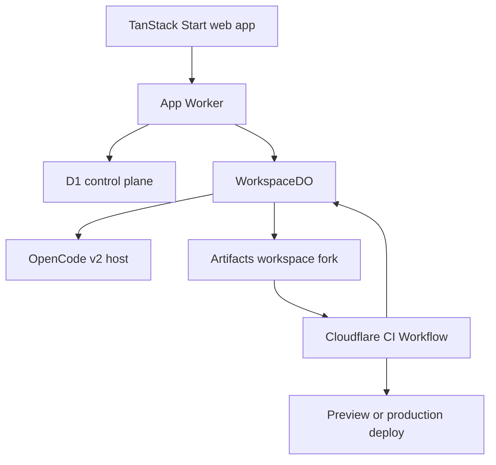

# Sylph

Cloud workspaces for coding agents.

Sylph is an Apache-2.0 licensed, Cloudflare-native system for durable coding-agent workspaces. Operators deploy one Installation into their own Cloudflare account, claim its default Organization with their authenticated account, and invite other Users from the Admin surface.

## Deploy an Installation

Sylph is deployed from a fork. Fork this repository, clone your fork, and run the guided setup:

```sh
./scripts/setup.sh
```

The wizard checks your tools and Cloudflare account, configures Alchemy with a deploy token, mints the narrower credentials the deployed Worker uses, deploys the stack, creates a GitHub App with the callback URL pre-filled, publishes production secrets to your fork, and opens `/setup` so you can claim the Installation with your own account.

Read [docs/operators.md](docs/operators.md) for prerequisites, the resources it creates, cost drivers, upgrades, teardown, and troubleshooting. Maintainer topics such as releases, the release-smoke test system, and OAuth across preview stages live in [docs/maintainers.md](docs/maintainers.md).

## Product direction

Build a web IDE for parallel coding-agent work on Cloudflare. The interface should borrow bb's dense, keyboard-first workspace and Conductor's task-focused parallelism. It should not reproduce bb's local-host architecture.

Sylph is a Bun monorepo managed with Turborepo. The web app lives in `apps/web`. Shared database code lives in `packages/db`, and the shared design system lives in `packages/ui`. This keeps both packages available to a future `apps/desktop` client without coupling them to TanStack Start.

## Local development

Copy `.env.example` to `.env` and provide the required secrets. Docker must be running: Alchemy pulls the CI sandbox image for local development and for deploys. Configure a GitHub App with read and write Contents permission, read and write Pull requests permission, read-only Email addresses account permission, user authorization during installation, and this local callback URL:

```text
http://localhost:1337/api/auth/callback/github
```

Then install and start the Cloudflare-backed TanStack Start app:

```sh
bun install --frozen-lockfile
bun run dev:cloudflare -- --stage dev
```

When `ALLOW_TEST_MAGIC_LINKS=true`, local development stores requested magic-link URLs in `magic_link_outbox` and exposes the latest link in the sign-in screen. Production setup disables this seam and uses GitHub authentication.

The core unit is a **workspace**:

- One Cloudflare Durable Object owns one workspace.
- One OpenCode v2 host lives for the lifetime of that Durable Object instance.
- One Cloudflare Artifacts fork stores the workspace's code.
- One or more OpenCode sessions can work inside the workspace.
- Cloudflare CI runs builds, tests, previews, and deployments outside the agent runtime.

The coding agent runs in the Durable Object. It can reason, read, search, and edit through OpenCode's Workerd-safe services. It must send process-heavy work to Cloudflare CI. This keeps `node_modules`, build output, and arbitrary processes out of Durable Object storage.

## Monorepo conventions

- Use Bun for package installation, scripts, tests, and lockfile management.
- Declare `packageManager: "bun@<pinned-version>"` in the root `package.json`.
- Configure Bun workspaces for `apps/*` and `packages/*`.
- Use Turborepo for `dev`, `build`, `typecheck`, `lint`, and `test` task orchestration.
- Commit one root `bun.lock`. Do not add npm, pnpm, or Yarn lockfiles.
- Keep deployable applications in `apps/` and reusable code in `packages/`.
- Do not create `apps/desktop` until desktop work starts. Keep package APIs runtime-neutral where practical so the desktop app can reuse them later.

## The architecture



### Control plane: TanStack Start, D1, and Better Auth

The TanStack Start Worker serves the product UI and authenticated server routes. It uses Better Auth with magic links and GitHub login. D1 stores data that the app must query across users, projects, and workspaces.

D1 is the correct place for:

- Better Auth users, sessions, accounts, and verification records.
- Project and workspace lists.
- Workspace status snapshots.
- Lightweight agent-session indexes.
- CI-run and deployment indexes.
- User and project settings.

D1 must not store full agent transcripts, file contents, build logs, or secret values.

### Data plane: one `WorkspaceDO` per workspace

The Durable Object is the single writer for live workspace state. Its name must be derived from the immutable workspace ID. The current runtime creates one `OpenCodeWorkerd` host during construction and retains its promise for later requests. Move that boot behind a lazy getter before claiming idle hibernation.

The OpenCode Cloudflare profile already uses the object's SQLite storage and persists durable events for eviction recovery. Do not copy those internal event rows into D1. Subscribe to OpenCode's event stream for live updates and derived status only.

Use the Durable Object for:

- OpenCode sessions and their durable events.
- The OpenCode virtual working filesystem.
- Prompt ordering and one active turn per session.
- Live approvals and durable questions. Approval prompts are listed again on socket connect but are not yet durable across eviction.
- Workspace-local jobs and idempotency keys.
- An outbox for Artifacts, CI, and D1 side effects.
- Browser WebSockets accepted through the Hibernatable WebSocket API, with durable-sequence replay and presence attachments. The live OpenCode subscription can still keep the object active.

Use Drizzle's Durable SQLite driver for product-owned tables. Prefix these tables with `app_` so they do not collide with OpenCode's private schema.

### Code: Cloudflare Artifacts

Artifacts is the canonical code store. The Durable Object filesystem is a working copy and cache.

Use this repository model:

- One base Artifacts repository per project.
- One Artifacts fork per workspace.
- Record the base repository, base commit, workspace repository, and head commit explicitly.
- Commit after a coherent agent change, before CI, and when the user requests a checkpoint.
- Merge an accepted workspace result into the project's default branch.
- Delete or archive the workspace fork under a retention policy.

Forks fit parallel agent work better than shared mutable branches. They isolate credentials, CI events, retention, and failed experiments. The schema can still support a branch-backed workspace later through a `repository_mode` column.

Never persist an Artifacts access token in D1 or Durable Object SQLite. Use the Workers binding when possible. Mint a short-lived repo token only when a CI Sandbox needs Git smart HTTP access.

### Builds and commands: Cloudflare CI

The OpenCode host must not depend on a long-lived local process or terminal. Replace shell-oriented work with typed tools supplied by an Effect plugin:

- `ci.run` (`workspace_run_checks`): install, type-check, lint, test, build, preview, and verify a commit.
- `ci.status` (`workspace_check_status`): read the current run state and its concise diagnostics.
- `artifact.checkpoint` (`workspace_checkpoint`): write the working tree and create a commit without CI.
- `artifact.diff` (`workspace_diff`): compare the working copy or the workspace head with its base.
- `artifact.merge` (`workspace_request_merge`): report acceptance readiness; a User performs the merge.
- `deploy.preview` (`workspace_preview`): find or build the preview for the current checkpoint.
- `deploy.production` (`workspace_production`): read production history; an Admin confirms deploys.
- `workspace_browser`: drive the preview in a Cloudflare browser and capture evidence.

An Artifacts push event starts a Cloudflare CI Workflow. Each command runs in a Sandbox-backed, retryable Workflow step. Store dependency snapshots in R2 through the CI SDK.

[`workspace-ci.ts`](./apps/web/src/server/workspace-ci.ts) is Sylph's CI-as-Code pipeline built on `@cloudflare/ci`, following Cloudflare's [authored pipeline example](https://github.com/cloudflare/ci/blob/main/examples/cloudflare-artifacts/cloudflare.ci.ts). Project Repositories do not need a Sylph-specific execution manifest. They expose recognizable package scripts; Sylph owns the surrounding Check lifecycle, credential scoping, diagnostics, repair, Preview identity, and browser evidence in application code. Add an execution adapter seam only when more than one real Project execution model exists.

Each Project repository must define `typecheck`, `lint`, `test`, `build`, `sylph:preview`, and `sylph:deploy` package scripts. Sylph sets `SYLPH_CHECKPOINT` to the exact commit under test and `SYLPH_DEPLOYMENT` to `preview` or `production`. The preview page must render these values and expose `data-sylph-checkpoint="<exact commit SHA>"` and `data-sylph-deployment="preview"` on the same visible element. The preview script must print `SYLPH_PREVIEW_URL=https://...` after the deployment is reachable. The production script must print `SYLPH_PRODUCTION_URL=https://...`. A missing script or URL fails its Check rather than silently weakening acceptance or deployment history.

Do not keep a Durable Object request open while CI runs. `ci.run` should checkpoint the tree, create a run, and return its ID. When the Workflow completes, it calls the `WorkspaceDO`. The object appends a product event and sends a synthetic OpenCode message with the result. A resume policy can start a repair turn when the user enabled automatic repair.

This callback must be idempotent. Key it by the Workflow instance ID and attempt number.

The object owns the resume policy. Automatic repair is bounded twice: each Check accepts at most two repair turns, and the Workspace accepts at most three automatic repair turns in a row. A User prompt or a passing Check restores the Workspace budget; when it is exhausted, the agent is told the Check failed and waits for direction. See [ADR 0008](./docs/adr/0008-workspace-owned-check-loop.md).

The agent also gets the Preview browser. `workspace_browser` opens a path on the current Preview through the Cloudflare Browser Run binding, returns the rendered markdown and accessibility tree, and stores a screenshot as Check evidence. The tool refuses every origin other than the Preview.

## Adapting bb's schema

bb models a desktop daemon, local hosts, directories, worktrees, terminal sessions, plugins, threads, and one shared SQLite event log. The Cloudflare product needs the same product concepts, but not the same machine model.

| bb table or concept | Cloudflare adaptation | Store |
|---|---|---|
| `user`, `apikey` | Better Auth core tables; add personal access tokens later | D1 |
| `hosts` | Remove. `WorkspaceDO` is the addressable host | — |
| `host_daemon_sessions` | Remove. Durable Object lifecycle replaces daemon leases | — |
| `projects` | Keep as `projects`; add Artifacts identity and ownership | D1 |
| `project_execution_defaults` | Keep as project model and permission defaults | D1 |
| `project_sources` | Replace with the base Artifacts repository and optional import origin | D1 |
| `environments` | Rename to `workspaces`; replace host/path/worktree fields with DO and Artifacts fields | D1 index + DO |
| `threads` | Rename to `agent_sessions`; map each row to an OpenCode session | D1 index + DO |
| `events` | Use OpenCode's event store inside the workspace object | DO only |
| `queued_thread_messages` | Keep workspace-local command ordering | DO only |
| `deferred_thread_messages` | Use OpenCode inbox or a small workspace-local queue | DO only |
| `pending_interactions` | Keep approvals and questions next to the session | DO only |
| `terminal_sessions` | Replace with short-lived `ci_runs` and CI tasks | D1 index + Workflows |
| `thread_tabs` | Keep durable shared tabs only if collaboration needs them; keep active tab and panel sizes in the browser | D1 or client |
| `thread_search_segments` | Defer. Add a separate search index only after transcript search proves necessary | Later |
| `thread_dynamic_context_file_states` | Let OpenCode own context state | DO only |
| plugin marketplace tables | Remove from the MVP. Ship one first-party Effect plugin | — |
| plugin key/value and settings | Use OpenCode's plugin-scoped durable storage | DO only |
| `app_settings_values`, `app_theme` | Replace with user-scoped JSON settings | D1 |

The largest change is intentional: do not create a second product event log in D1. OpenCode already persists the durable event stream in the Durable Object. D1 stores only enough derived state to render lists without waking every workspace.

## Proposed D1 schema

Use Drizzle for the D1 schema and migrations.

### Better Auth tables

Generate the current Better Auth tables for:

- `user`
- `session`
- `account`
- `verification`

Configure GitHub sign-in with a GitHub App client ID and client secret. Give the App read and write Contents and Pull requests repository permissions plus read-only Email addresses account permission, enable user authorization during installation, and let each installation choose its repositories. The resulting user access token is repository-scoped and powers private import, synchronization, push delivery, and pull-request delivery without a personal access token.

### `user_settings`

| Column | Purpose |
|---|---|
| `user_id` | Better Auth user ID |
| `key` | Stable setting name |
| `value_json` | Validated JSON value |
| `updated_at` | Last update |

Use `(user_id, key)` as the primary key.

### `projects`

| Column | Purpose |
|---|---|
| `id` | Immutable project ID |
| `owner_user_id` | Initial single-owner access model |
| `name`, `slug` | Display and URL identity |
| `artifact_namespace` | Artifacts namespace |
| `artifact_repo` | Canonical base repository |
| `default_branch` | Accepted code branch |
| `import_origin_url` | Optional source used to create the project |
| `default_provider`, `default_model` | OpenCode defaults |
| `default_reasoning_level` | OpenCode reasoning default |
| `default_permission_mode` | Tool policy default |
| `archived_at`, `created_at`, `updated_at` | Lifecycle |

Start with personal ownership. Add `project_members` only when collaboration becomes an MVP requirement.

### `workspaces`

| Column | Purpose |
|---|---|
| `id` | Immutable workspace ID and DO routing key |
| `project_id`, `owner_user_id` | Ownership and list queries |
| `title` | Human-readable task name |
| `status` | `provisioning`, `ready`, `running`, `waiting`, `idle`, `merging`, `archived`, `error` |
| `repository_mode` | Initially `fork` |
| `base_artifact_repo`, `base_ref`, `base_commit` | Starting point |
| `workspace_artifact_repo` | Isolated working repository |
| `head_commit` | Latest durable checkpoint |
| `active_session_id` | Current UI focus, not runtime authority |
| `latest_attention_at`, `last_read_at` | Sidebar badges |
| `error_code`, `error_summary` | Safe list-level error state |
| `archived_at`, `created_at`, `updated_at` | Lifecycle |

Do not store a Durable Object ID. Derive the object name from `workspace.id` so routing is deterministic.

### `agent_sessions`

This is a lightweight index. OpenCode owns the complete session.

| Column | Purpose |
|---|---|
| `id` | Product session ID |
| `workspace_id` | Owning workspace |
| `opencode_session_id` | Durable OpenCode session ID |
| `parent_session_id` | Optional delegation lineage |
| `title` | Sidebar label |
| `status` | Derived state for lists |
| `model_override`, `reasoning_override` | Sticky overrides |
| `latest_attention_at`, `last_read_at` | User attention |
| `archived_at`, `created_at`, `updated_at` | Lifecycle |

### `ci_runs`

| Column | Purpose |
|---|---|
| `id` | Product run ID |
| `project_id`, `workspace_id`, `agent_session_id` | Origin |
| `workflow_instance_id` | Cloudflare Workflow identity |
| `commit_sha` | Exact code tested |
| `kind` | `check`, `test`, `build`, `preview`, `deploy` |
| `status` | `queued`, `running`, `passed`, `failed`, `cancelled` |
| `summary_json` | Small, redacted result summary |
| `started_at`, `finished_at`, `created_at` | Timing |

Keep raw command logs in Cloudflare's CI and observability systems. Return only bounded, redacted diagnostics to the agent and D1.

### `deployments`

| Column | Purpose |
|---|---|
| `id` | Deployment ID |
| `project_id`, `workspace_id`, `ci_run_id` | Source |
| `commit_sha` | Exact deployed revision |
| `environment` | `preview` or `production` |
| `status` | Deployment state |
| `url` | Preview or production URL |
| `created_at`, `updated_at` | Lifecycle |

## Product-owned Durable Object schema

OpenCode's Workerd host owns its internal tables. Add only the state that the product needs around it.

### `app_workspace_state`

One row with the project ID, workspace ID, base commit, head commit, sync status, schema version, and timestamps.

### `app_external_jobs`

Tracks CI and deployment requests that outlive one Durable Object event. Include the job ID, kind, external ID, status, request payload hash, result summary, and timestamps.

### `app_outbox`

Tracks reliable side effects: checkpoint to Artifacts, update the D1 index, start CI, and send a notification. Include a stable idempotency key, attempt count, next-attempt time, and last error.

### `app_processed_callbacks`

Records external event IDs so duplicate Workflow callbacks cannot resume an agent twice.

Do not add a second transcript table. Do not store dependency trees or build output in the object.

## OpenCode and Effect integration

Create one first-party package, such as `packages/opencode-cloudflare-plugin`.

It should use `@opencode-ai/plugin/effect` to:

1. Register typed Cloudflare tools with Effect Schema.
2. Subscribe to OpenCode's event stream.
3. Derive workspace and session status.
4. Write durable plugin settings through OpenCode plugin storage.
5. Apply session hooks that enforce project policy.
6. Rewrite or remove shell behavior that cannot run safely in Workerd.
7. Send bounded progress events to the UI.

Keep model-driven behavior inside OpenCode. Keep authoritative state transitions in deterministic Effect services. A model may request a commit, merge, CI run, or deploy. The service validates the request, applies access rules, records it, and performs the action.

Suggested Effect services:

- `ProjectRepository`
- `WorkspaceRepository`
- `ArtifactService`
- `CheckpointService`
- `CiService`
- `DeploymentService`
- `WorkspaceIndexService`
- `NotificationService`
- `AccessPolicy`

Each service should expose tagged errors. Convert errors to stable product error codes at Worker and Durable Object boundaries.

## Main flows

### Create a project

1. Authenticate the user.
2. Create a D1 project row.
3. Create or import the base Artifacts repository.
4. Add the default Cloudflare project template when the repository is empty.
5. Open the project dashboard.

### Start a workspace

1. Insert the D1 workspace row with `provisioning` status.
2. Fork the project's Artifacts repository.
3. Resolve the base commit and save both repository identities.
4. Address the `WorkspaceDO` by workspace ID.
5. Initialize the OpenCode Workerd host and hydrate its working tree.
6. Create the first OpenCode session.
7. Publish `ready` to D1 and connect the browser WebSocket.

Every step needs an idempotency key based on the workspace ID.

### Run an agent turn

1. The authenticated app route checks project access.
2. It forwards the prompt to the correct `WorkspaceDO`.
3. The object orders the prompt and calls the OpenCode session API.
4. OpenCode persists events in the object's SQLite database.
5. The object streams events to connected browsers.
6. The Effect plugin converts external requests into validated product jobs.
7. The object updates only derived list state in D1.

### Check code

1. The agent or user requests `ci.run`.
2. The object checkpoints the working tree to the workspace Artifacts fork.
3. The Artifacts push event starts the CI Workflow.
4. The tool returns the run ID without holding the object open.
5. CI installs with `bun install --frozen-lockfile`, then runs checks in isolated steps.
6. CI calls the workspace object with a redacted result.
7. The object publishes the result and optionally starts a repair turn.

### Accept work

1. Show the base-to-head diff in the right panel.
2. Require a passing policy-selected CI run.
3. Merge the workspace result into the project default branch.
4. Start the production pipeline for a production merge.
5. Mark the workspace merged and retain its fork for `WORKSPACE_FORK_RETENTION_SECONDS` (seven days by default). Archived, unaccepted workspaces follow the same retention through the `WorkspaceRetention` Workflow, and archive locks the runtime read-only.

## UI plan

Use shadcn components as low-level primitives, but define a custom visual system. Avoid the default shadcn dashboard appearance.

### Desktop layout

- **Left rail:** projects, workspaces, unread state, current run state, and a create-workspace action.
- **Main column:** agent transcript with tool calls, plans, approvals, and compact CI results.
- **Right workspace:** tabs for Files, Diff, Preview, CI, and Deployments.
- **Top bar:** project, workspace fork, model, agent state, checkpoint, and merge action.
- **Bottom composer:** prompt, attachments, mode, model, and permission control.

The workspace list is the product's home screen. Each row should answer four questions: what is the task, what is the agent doing, does it need attention, and can the result be reviewed?

### Interaction rules

- Preserve the transcript position while users switch right-panel tabs.
- Keep panel widths and the active tab in local browser state.
- Persist only shared tab descriptors if multiplayer use requires them.
- Render live tokens as transient UI state, then reconcile with persisted OpenCode events.
- Treat CI and deployment output as structured events, not terminal text.
- Offer a terminal-shaped log viewer for familiarity, but do not model it as a persistent terminal session.
- Support command-palette and keyboard navigation from the first release.

## Repository structure

```text
apps/
  web/                       TanStack Start UI and authenticated routes
  ci/                        Cloudflare CI Workflow Worker
  desktop/                   Future desktop client; not created for the MVP
packages/
  auth/                      Better Auth configuration
  db/                        Shared D1 Drizzle schema and repositories
  ui/                        Shared shadcn-based design system
  workspace-do/              WorkspaceDO, DO Drizzle schema, migrations
  opencode-cloudflare-plugin Effect plugin and typed tools
  artifacts/                 Artifacts service and checkpoint logic
  domain/                    Effect Schemas, IDs, errors, status values
alchemy.run.ts               Alchemy v2 stack
package.json                 Bun workspaces and root Turbo scripts
turbo.json                   Monorepo task graph
bun.lock                     The only dependency lockfile
```

Keep one domain schema for every RPC input, database JSON value, Workflow payload, and Durable Object callback. Do not maintain parallel Zod and Effect definitions.

## Alchemy v2 resources

Define and bind:

- TanStack Start website Worker.
- `WorkspaceDO` namespace with SQLite storage.
- D1 database and Drizzle migrations.
- Artifacts namespace or binding.
- CI Workflow Worker and Workflow class.
- Sandbox, container, and Durable Object bindings required by `@cloudflare/ci`.
- R2 bucket for CI dependency snapshots and bounded build artifacts.
- Email Service sending binding.
- Secrets for Better Auth, GitHub OAuth, and model providers.
- Custom domain, routes, and environment-specific outputs.

Use one Alchemy stage per platform environment. User-created project previews are application data created by CI; they are not new Alchemy stages for the platform itself.

Alchemy's TanStack Start integration adds its own Vite integration. Remove `@cloudflare/vite-plugin` from the web app if the scaffold includes it.

## Auth and email

- Use Better Auth's generated D1 schema.
- Enable the magic-link server and client plugins.
- Implement `sendMagicLink` with the Cloudflare Email Service binding.
- Enable GitHub as a social provider and request email access.
- Use a stable production OAuth callback URL.
- Keep login identity separate from repository authorization.
- Rate-limit magic-link requests by normalized email and IP.
- Send CI completion email only when a user opts in or a run requires attention.

## Security boundaries

- Authenticate in the app Worker before it calls a Durable Object.
- Pass a signed, short-lived actor context to the object. Do not trust user IDs from request bodies.
- Validate project and workspace ownership again before destructive actions.
- Keep provider keys and deployment credentials in Worker secrets or Cloudflare Secrets Store.
- Never write secrets into the workspace filesystem, transcript, D1, CI logs, or Artifacts.
- Redact CI output before it enters an agent message.
- Add explicit limits for file size, total working-tree size, event payload size, agent turn duration, CI retries, and automatic repair loops.
- Require user confirmation for production deploys and destructive Cloudflare operations in the first release.

## Delivery plan

### Phase 1: vertical slice

Create the Bun/Turborepo skeleton with `apps/web`, `packages/db`, and `packages/ui`. Then build one complete path: sign in, create a blank Cloudflare project, start one workspace, send one prompt, edit one file, checkpoint to Artifacts, and show the diff.

Do not build CI, previews, plugin installation, collaboration, or transcript search yet.

### Phase 2: durable workspace runtime

The browser transport now uses Hibernatable WebSockets with durable event replay, check updates, and presence. Remaining runtime work includes proven idle hibernation, durable approval recovery, the outbox, and D1 status projection.

Prove that a workspace resumes after object eviction without losing the transcript or working tree.

### Phase 3: Cloudflare CI

Add Artifact push triggers, Bun dependency caching, type-check, lint, test, build, structured result callbacks, and the CI panel.

Prove that duplicate Workflow retries do not duplicate commits, callbacks, or agent repair turns.

### Phase 4: previews and merge

Add workspace review, merge policy, preview deployments, production deployment from the default branch, and deployment status.

Use explicit CI steps for preview and production deployment. Do not block the MVP on Cloudflare's announced but not yet available `build.preview()` and `build.deploy()` primitives.

### Phase 5: parallel work

Add multiple workspaces per project, attention badges, workspace switching, delegated OpenCode sessions, diff comparison, cancellation, archive, and retention.

### Phase 6: Cloudflare-native agent knowledge

Add curated Cloudflare skills, docs references, Cloudflare API tools, project-specific commands, and safe infrastructure inspection. Keep infrastructure writes behind typed policy checks.

### Phase 7: collaboration and platform hardening

Only after the single-owner workflow works well, add project membership, presence, shared review, audit events, quotas, billing boundaries, export, retention controls, and disaster-recovery tooling.

## What to preserve from bb

Preserve bb's strongest product ideas:

- Projects contain several independent workspaces.
- Threads have explicit lifecycle and attention state.
- The event stream is append-only and replayable.
- Execution settings can inherit from project defaults and accept session overrides.
- Agent questions are durable. Permission prompts still need the durable bridge described in ADR 0007.
- Presentation state stays client-local unless users need to share it.

Remove the parts that exist only because bb controls local computers:

- Hosts and daemon leases.
- Absolute paths.
- Worktree discovery.
- Persistent terminal sessions.
- Local plugin artifacts and marketplaces.
- A single global SQLite database for every event.

## Current platform constraints

As of August 25, 2026:

- OpenCode's Cloudflare profile is designed for one retained Workerd host inside a Durable Object and persists events in the object's SQLite storage.
- Cloudflare Artifacts is still documented as closed beta. Access is a delivery dependency.
- Cloudflare CI is built on Workflows and Sandbox. Its commands run in retryable steps, so all side effects must be idempotent.
- Artifacts push events can trigger a CI Workflow for one repository or an entire namespace.
- Cloudflare's `build.preview()` and `build.deploy()` primitives were announced as future work. The first deployment path should use explicit Workflow steps.
- Cloudflare Email Sending is available through a native Worker binding, but arbitrary-recipient sending requires the applicable paid service access.

## Recommended first implementation decision

Start with one project owner, one first-party OpenCode Effect plugin, one Artifacts fork per workspace, and no persistent shell. This gives the product the bb/Conductor interaction model without importing bb's local-machine complexity.

The first proof should answer one question: can an OpenCode session survive Durable Object eviction, resume from its durable event history, restore the exact Artifacts-backed working tree, and continue the same task? Build CI and deployment only after that proof passes.

## Sources

- [bb database schema](https://github.com/get-bb/bb/blob/main/packages/db/src/schema.ts)
- [OpenCode v2 Cloudflare SDK](https://opencode.ai/v2/docs/build/sdk/cloudflare/)
- [OpenCode v2 Effect plugin](https://opencode.ai/v2/docs/build/plugins/effect/)
- [Cloudflare Durable Objects storage and D1 comparison](https://developers.cloudflare.com/durable-objects/best-practices/access-durable-objects-storage/)
- [Cloudflare Artifacts](https://developers.cloudflare.com/artifacts/)
- [Artifacts Git protocol](https://developers.cloudflare.com/artifacts/api/git-protocol/)
- [Cloudflare CI](https://github.com/cloudflare/ci)
- [Cloudflare CI Workflows announcement](https://blog.cloudflare.com/ci-workflows/)
- [Alchemy TanStack Start guide](https://alchemy.run/cloudflare/frontend/tanstack-start/)
- [Drizzle with Durable Object SQLite](https://orm.drizzle.team/docs/sqlite/connect-cloudflare-do)
- [Better Auth magic links](https://better-auth.com/docs/plugins/magic-link)
- [Better Auth GitHub login](https://better-auth.com/docs/authentication/github)
- [Cloudflare Email Service sending](https://developers.cloudflare.com/email-service/get-started/send-emails/)
