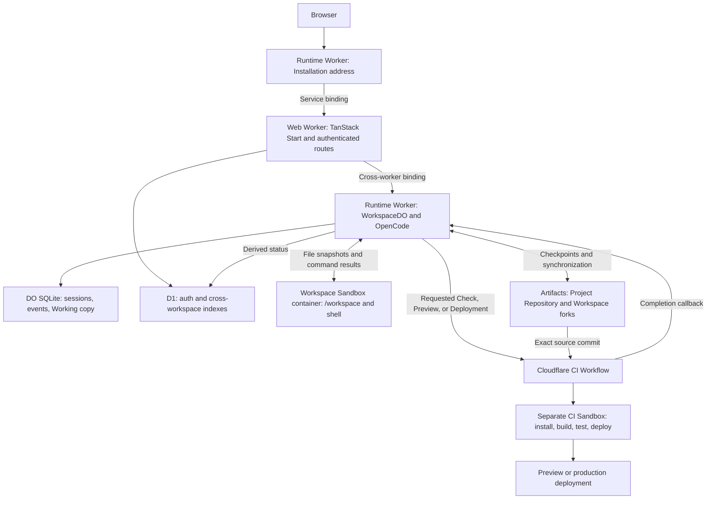

# Sylph

Cloud workspaces for coding agents.

Sylph provides durable coding-agent workspaces on Cloudflare under the Apache-2.0 license. Deploy an Installation in your account, sign in to claim its Organization, and invite Users from Admin.

## Deploy an Installation

Deploy through your GitHub fork with **Actions → Deploy production**. No local tools are required. Supply your Cloudflare account ID, deploy token, and a setup code. Choose a `workers.dev` address or set an optional custom hostname.

The workflow creates the resources and stable credentials, then links to `/setup`. Connect GitHub and claim your Installation there without a second deployment.

[Documentation](docs/README.md) · [Deploy your own Sylph](docs/operators.md) · [Fork the repository](https://github.com/kcc989/sylph/fork)

For local setup, clone your fork and run `./scripts/setup.sh` with Bun and Docker installed.

## Product model

An Installation contains one Organization. Members create Projects, each with one Project Repository and isolated Workspaces. An agent edits a Workspace’s Working copy and saves Checkpoints to its Workspace fork. A User accepts reviewed work into the Project Repository; an Admin can deploy an Accepted commit to production.

Checks, Previews, browser evidence, and automatic Check repair are requested separately. Acceptance does not require a Check or Preview by default. Configured browser journeys must pass or have a recorded User exception. See [the domain glossary](CONTEXT.md) for the full vocabulary.

## The architecture

The runtime Worker retains the Installation address, `WorkspaceDO`, container classes, Workflow classes, and scheduled tasks. It forwards web requests through a service binding to a separate TanStack Start Worker. Alchemy binds both deployments in [`alchemy.run.ts`](alchemy.run.ts). UI-only releases can update the web Worker without uploading the runtime. See [the deployment decision](docs/adr/0011-separate-web-and-runtime-deployments.md).



| Resource | Responsibility | Durable storage |
|---|---|---|
| Web Worker and D1 | Authentication, membership, routing, and cross-workspace lists | D1 product records |
| `WorkspaceDO` | OpenCode sessions, event replay, prompt ordering, and file tools | Durable Object SQLite |
| Workspace Sandbox container | Agent shell commands and their filesystem | File changes must synchronize back to the Durable Object |
| Cloudflare Artifacts | Accepted source history and Workspace Checkpoints | Project Repository and Workspace forks |
| Cloudflare CI and its Sandbox | Requested verification and deployment of an exact commit | Workflow state and product operation records |

### Workspace state and agent execution

The web Worker routes authenticated requests to one `WorkspaceDO` per Workspace. The object starts OpenCode v2 in Workerd and retains it for that instance’s lifetime. There is no separate OpenCode Worker host.

OpenCode sessions and events persist in Durable Object SQLite. Product-owned tables store Working copy files, Git state, Checks, and pending operations. Native file and search tools use that durable Working copy. Browser WebSockets replay stored events. OpenCode starts on the first Workspace operation or socket hello. Socket rejection, ping, and close do not boot it. Its live subscription can still keep the object active; lazy initialization alone does not prove idle hibernation.

OpenCode's process spawner uses a dedicated workspace Sandbox container:

1. Apply pending command results before starting the next command.
2. Copy the durable Working copy and Git metadata into `/workspace`, removing stale synchronized files.
3. Run the command in the container.
4. Synchronize source changes back to the durable Working copy, rejecting conflicts with newer edits.
5. Return the exit code and bounded output to OpenCode.

The container provides a real shell and filesystem. Its dependency cache can be discarded; durable files remain in the object. Shell Git commits are sandbox-local. `workspace_checkpoint` records a durable commit in Artifacts. See [sandbox agent execution](docs/sandbox-agent.md) for recovery, permissions, and resource limits.

Cursor and Codex use separate provider containers where their integrations need Node. Workspace state remains in the Durable Object. The [Cursor guide](docs/cursor-provider.md) explains transport and isolation.

### Code, Checks, and deployments

Cloudflare Artifacts stores the Project Repository and one fork per Workspace. The durable Working copy can contain unsaved edits; a Checkpoint records those edits as a commit in the Workspace fork. Acceptance merges reviewed work into the Project Repository.

Cloudflare CI executes requested operations on an exact source commit in a separate Sandbox. It does not reuse the mutable agent workspace. Workflows report results to `WorkspaceDO`; a failed Check starts a repair Turn only when requested by the User and within the Workspace repair limit.

| Operation | Behavior |
| --- | --- |
| Checkpoint | Commit the Working copy to the Workspace fork |
| Check | Install dependencies and run `typecheck`, `lint`, `test`, and `build` |
| Preview | Install, build, plan isolated resources, and run `sylph:preview` |
| Acceptance | Merge a reviewed Checkpoint into the Project Repository |
| Production deployment | Build and deploy an Admin-confirmed Accepted commit |
| Managed release or recovery | Run the selected application recovery and verification contract |

Project scripts define commands. Sylph checks access, isolates resources, records operations, and stores optional evidence. Project deployment commands receive scoped capabilities through the Installation broker. See [templates](docs/project-templates.md), [release safety](docs/release-safety.md), and [resource management](tools/resource-management/README.md).

### Control plane and live state

Better Auth handles authentication. D1 stores Installation membership, Project and Workspace indexes, Provider connections, deployment records, and other cross-workspace data. Stored credentials are encrypted. Full OpenCode transcripts and Working copy files remain in Durable Object storage; D1 is not a second session event log.

The Workspace browser shares a persistent Browser Run session between the agent and human controls. Users can require journeys whose evidence identifies the exact Preview, policy, and session. See [browser testing](docs/browser-testing.md). Production observations and incident-linked repair Workspaces are described in [project operations](docs/project-operations.md).

## Local development

Copy `.env.example` to `.env` and provide the required secrets. Docker must be running: Alchemy pulls the CI sandbox image for local development and for deploys. Configure a GitHub App with read and write Contents permission, read and write Pull requests permission, read-only Email addresses account permission, user authorization during installation, and this local callback URL:

```text
http://localhost:1337/api/auth/callback/github
```

Then install and start the Cloudflare-backed TanStack Start app:

```sh
bun install --frozen-lockfile
bun run dev:cloudflare -- --stage dev
```

With `ALLOW_TEST_MAGIC_LINKS=true`, local development stores requested links in `magic_link_outbox` and shows the latest on the sign-in screen. Production disables test magic links and uses GitHub authentication.

## Repository structure

```text
apps/
  web/
    src/worker.ts            Web entry point
    src/runtime-worker.ts    Runtime entry point and resource exports
    src/server/             WorkspaceDO, OpenCode, Sandbox adapter, CI, auth, Git
    src/routes/             Product UI and authenticated routes
packages/
  cloudflare-recovery/      Managed resource recovery contracts
  cursor-provider/          Cursor provider runtime and container image
  db/                       D1 Drizzle schema and repositories
  domain/                   Shared Effect schemas and domain contracts
  ui/                       Presentational design system
alchemy.run.ts              Alchemy v2 stack
package.json                Bun workspaces and root Turbo scripts
bun.lock                    Dependency lockfile
```

Use Bun and Turborepo for workspace tasks, Oxlint for linting, and Oxfmt for formatting. Keep shared UI presentational and define shared input and output schemas once in `@workspace/domain`. Follow [AGENTS.md](AGENTS.md) for source and dependency rules.

## Verification and operations

```sh
bun run format:check
bun run lint
bun run typecheck
bun run test
bun run build
bun run check:workers
bun run smoke:workers
bun run smoke:runtime
```

The built-worker smoke checks the service binding, cross-worker Workspace access, lazy initialization, WebSocket ping, and SQLite persistence across restart. `check:workers` profiles the runtime deployment artifact and the Cloudflare-compatible web build; profiles and measured budgets are saved under `dist/`. Its temporary Wrangler configuration performs local profiling only.

The local runtime smoke uses Workerd and deterministic providers. It does not prove live authentication, model inference, or Cloudflare deployment behavior. For a fresh deployed test, follow the [release smoke runbook](tests/release-smoke/README.md). Record source, template, stage, auth mode, and lifecycle results separately.

Alchemy v2 manages infrastructure through `alchemy.run.ts`. Use one stage per Installation environment. Project Previews are managed application deployments, not new Sylph platform stages. Production deployments and destructive operations require explicit approval.

The [documentation index](docs/README.md) links operating guides and architecture decisions. [Archived evidence](docs/archive/README.md) records earlier test runs and their limits; it does not confirm current deployment status.
