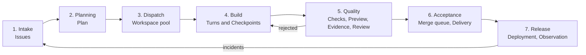

# Sylph as a Cloudflare software factory

Status: vision, 2026-09-09. Not yet decided; see the open decisions at the end.

## The thesis

Emdash is an agentic development environment. It runs many coding agents in parallel, one per Git worktree, and gives the developer one place to review, open pull requests, watch CI, and merge. It is local-first: an Electron app, a SQLite database, terminals, and SSH to remote machines.

Sylph should become the same kind of product, but with two differences:

1. **It is a factory, not an environment.** An environment helps a person do work. A factory takes work orders in, moves them through fixed stations, and ships verified product out. People supervise the line. They do not stand at every station.
2. **Cloudflare is the only floor.** The agents run on Cloudflare. The code lives in Cloudflare Artifacts. Checks run in Cloudflare CI. The product deploys to Cloudflare. The factory knows Cloudflare's resources, limits, bindings, and costs as first-class facts. It does not try to be a general IDE for any stack on any host.

The one-sentence version: **Sylph turns an Issue into a verified, deployed Cloudflare release with no local machine in the loop.**

## Where Sylph is today

Most of the factory's stations already exist as separate features. The table compares Emdash, Sylph today, and the factory target.

| Capability         | Emdash                                                                 | Sylph today                                                                                           | Factory target                                                            |
| ------------------ | ---------------------------------------------------------------------- | ----------------------------------------------------------------------------------------------------- | ------------------------------------------------------------------------- |
| Isolation per task | Git worktree and branch on a host                                      | Artifacts fork plus one Durable Object per Workspace                                                  | Same, plus a Workspace pool that Sylph opens on its own                   |
| Where agents run   | Local CLIs, SSH remote                                                 | OpenCode in the Durable Object; commands in a Cloudflare Sandbox; Codex and Cursor through Containers | Named Agent runtimes selected per Issue                                   |
| Supported agents   | Claude Code, Codex, Cursor, OpenCode, Amp, Devin, Qwen, Droid, Copilot | OpenCode with many Providers; Codex and Cursor subscriptions                                          | OpenCode by default; sandboxed CLI agents as additional runtimes          |
| Work intake        | Linear, GitHub, Jira, GitLab, Asana, and others                        | Sylph Issues; GitHub Upstream Repository                                                              | Sylph Issues fed by GitHub Issues, Linear, telemetry incidents, and plans |
| Review             | Diff, PR, CI checks, merge in one view                                 | Review, Acceptance, Delivery by push or PR                                                            | Same, plus Merge queue and an automated first review                      |
| Verification       | Whatever the host's CI does                                            | Checks, Preview, browser Evidence, journeys, automatic repair                                         | Same, run by policy on every Checkpoint that reaches the queue            |
| Deployment         | Out of scope                                                           | Production Deployments, release gates, recovery, Rollback                                             | Same, with Release trains and observation feedback                        |
| Observability      | Notifications and lifecycle hooks                                      | Production health, incidents, repair Workspaces                                                       | Incidents open Issues; the line closes them                               |
| Where state lives  | Local SQLite                                                           | D1, Durable Objects, Artifacts                                                                        | Same                                                                      |
| Shape              | Desktop app                                                            | Web app on Workers                                                                                    | Web app on Workers, plus a Slack and GitHub surface                       |

The gap is not features. The gap is the loop. Today a User creates a Workspace, prompts an agent, requests Checks, reviews, accepts, and deploys, one click at a time. The factory does those steps by policy and asks the User only where a decision is required.

## What a software factory means here

A factory has four properties. Each one maps to something concrete in Sylph.

**Work orders, not prompts.** The unit of input is an Issue with a written acceptance condition, not a chat message. A prompt is how a person talks to one Workspace. An Issue is how work enters the line.

**Stations with fixed contracts.** Every station accepts one input, produces one output, and can reject. The Check contract is already this: package scripts in, pass or fail out. The factory adds the same shape to planning, review, acceptance, release, and observation.

**Parallel lines with one merge point.** Many Workspaces run at once. Each one is a fork with its own Durable Object and CI history. They meet only at the Project Repository through Acceptance. Forks already give Sylph this; Emdash uses worktrees for the same reason.

**A feedback loop that closes.** A deployed release is observed. What is observed becomes an Issue. The Issue enters the line. Sylph already collects production health on a schedule and creates repair Workspaces. The factory makes that the normal path, not a special one.

## The line

Work moves through seven stations. Each station names the Sylph concept it uses, what exists today, and what the factory adds.

### 1. Intake

**Uses:** Issue.

**Today:** A User creates a numbered Issue in a Project. It is open or closed. It has no link to a Workspace.

**Adds:**

- An Issue gains an acceptance condition, a priority, labels, and a link to zero or more Workspaces.
- Sources feed Issues. GitHub Issues on the Upstream Repository synchronize both ways through the existing GitHub App. Linear is the second connector because it is the one Emdash users ask for most. A Cloudflare Queue receives each source event; a Workflow turns it into an Issue write. No source writes D1 directly.
- Incidents from production health become Issues with the telemetry attached as Evidence.
- An Issue can be marked **ready**. Only ready Issues reach Dispatch. This is the human control point at the start of the line.

### 2. Planning

**Uses:** Plan (new). A Plan is an agent-produced, User-approved decomposition of one Issue into ordered child Issues, each with its own acceptance condition.

**Today:** The `to-tickets` and `triage` Skills exist in the repository. There is no product object for a Plan.

**Adds:**

- A **planning Turn** runs in a read-only Workspace against the current Project Repository head. It uses the Cloudflare Skill and the Project's `AGENTS.md`. It writes a Plan, not code.
- A Plan is stored in D1 as a small tree of Issues with an ordering and a parallelism hint. The agent transcript that produced it stays in the Workspace Durable Object.
- The User approves, edits, or rejects the Plan. Approval marks child Issues ready. Nothing runs without this approval by default; a Project can opt into automatic approval for small Issues.
- The Plan records which Cloudflare resources the change is expected to touch. This feeds the resource plan that Sylph already requires before a deployment receives credentials.

### 3. Dispatch

**Uses:** Workspace, Workspace pool (new), Agent runtime (new).

**Today:** A User creates a Workspace by hand. Provisioning runs in the `WorkspaceProvisioning` Workflow. A Workspace has one OpenCode host in one Durable Object.

**Adds:**

- A **Dispatcher** is a Durable Object per Project. It watches ready Issues and opens Workspaces up to a Project concurrency limit. It reuses the existing provisioning Workflow. Each Workspace records its Issue.
- An **Agent runtime** is a named way to run an agent inside a Workspace. The default is OpenCode in the Durable Object with Sandbox commands, which is what exists. Additional runtimes run a CLI agent inside a Cloudflare Sandbox or Container against the same Workspace fork: Claude Code, Codex, and later others. Each runtime implements the same small contract: start a Turn with a prompt, stream events, produce a Checkpoint, and answer questions. This is how Sylph matches Emdash's multi-agent support without giving up Cloudflare as the host.
- A Project chooses a default runtime and model through the existing Model preference layers. An Issue can override both. Two Workspaces can be opened for one Issue with different runtimes to compare results; the User accepts one.
- Dispatch is the second human control point when concurrency or budget policy requires confirmation.

### 4. Build

**Uses:** Turn, Checkpoint, Steering message, Agent question.

**Today:** This station is complete. The agent works in the Durable Object. Commands run in a Sandbox. Checkpoints go to the Workspace fork. Questions are durable.

**Adds:**

- The first Turn of a dispatched Workspace is the Issue, its acceptance condition, and the Plan context, not a free prompt.
- Agent questions from many Workspaces collect in one **attention inbox** for the User. This is the main screen of the factory. Emdash's per-workspace notifications become one queue.
- A Build station has a budget: tokens, wall time, and Turn count per Issue, set by the Project. When a budget runs out, the Workspace waits for direction and the Issue shows **blocked**.

### 5. Quality

**Uses:** Check, Preview, Evidence, browser journey, Review.

**Today:** All of these exist and are optional. Automatic repair is bounded to three continuations. Review is a User activity on the Workspace diff.

**Adds:**

- A **Quality policy** per Project decides which operations run on each Checkpoint that a Workspace marks complete: Checks always, Preview when the change touches routes or bindings, journeys when a Preview exists. The policy is stored data, not code, and reuses the operations that exist.
- An **automated first review** is a read-only Turn by a second agent on the base-to-head diff, with the Issue's acceptance condition as the standard. It writes a Review with findings. It cannot accept. A finding it marks blocking sends the Workspace back to Build with the finding as a Steering message. This is the review bot pattern from GitHub, but inside the fork before anything leaves the Project.
- Preview Evidence is attached to the Issue, not only to the Check, so a reviewer opens the Issue and sees the screenshot and journey result without opening the Workspace.

### 6. Acceptance

**Uses:** Acceptance, Accepted commit, Delivery, Merge queue (new).

**Today:** A User accepts a reviewed Checkpoint. Sylph merges it into the Project Repository. Delivery pushes or opens a pull request on the Upstream Repository.

**Adds:**

- A **Merge queue** orders accepted Workspaces. Before each merge it rebases the fork on the current Project Repository head inside a Sandbox, re-runs the Quality policy on the rebased commit, and merges only on pass. This is the station that lets many parallel Workspaces converge without breaking the trunk.
- Acceptance stays a human decision by default. A Project can allow automatic Acceptance for Issues below a size threshold when the automated review found no findings and every policy operation passed.
- Delivery to GitHub remains as it is. The pull request body carries the Issue, the Plan step, the Check summary, and the Evidence links.

### 7. Release

**Uses:** Deployment, Rollback, release gates, production health.

**Today:** Admin-confirmed production Deployments with migration compatibility gates, recovery points, production journeys, coordinated D1 and R2 recovery, and scheduled health collection exist.

**Adds:**

- A **Release train** groups Accepted commits and deploys them on a schedule or on demand. The train runs the gates that exist. An Admin confirms, as now.
- Observation after a release is part of the station. Workers Observability errors, journey failures, and health incidents in the window after a Deployment open Issues that reference the Deployment. A Project can require the train to hold for a soak period and to Rollback on a defined incident rate.
- Issues opened by observation carry the trace, the failing route, and the Deployment. They enter Intake as ready when the Project allows it. This closes the loop.

## Cloudflare as the only floor

Being Cloudflare-only is what lets the factory be opinionated. Each station knows things that a general tool cannot.

- **Resources are typed.** A Project's resource plan already lists Workers, D1, KV, R2, Queues, Durable Objects, Workflows, and service bindings. Planning writes against that list. Quality checks that a change does not add a binding the plan does not declare. Release refuses a deploy whose Alchemy stack drifts from the plan.
- **Limits are facts.** The Cloudflare Skill and the Check contract encode Workers limits, D1 constraints, and Durable Object rules. The automated review checks against them. An agent that writes a long-running loop in a Worker gets a finding, not a production incident.
- **Every Preview is a real deployment.** Previews are isolated Alchemy stages. Evidence comes from Browser Rendering against a real URL. Nothing is mocked.
- **Data safety is built in.** D1 Time Travel, R2 snapshots, and Durable Object snapshots make Rollback a normal action. The factory can be bold at Build because Release can undo.
- **Models run near the code.** Workers AI and AI Gateway are Providers like any other. AI Gateway gives per-Project cost and rate limits, which is how the Build budget is enforced without Sylph counting tokens itself.
- **The factory is one Alchemy stack.** An operator deploys Sylph from GitHub Actions. The factory scales with Cloudflare, not with a fleet of machines to keep updated.

A **Cloudflare application catalogue** replaces a generic template gallery. Each entry is a Template Repository that passes the Check contract and declares its resources: a TanStack Start site, a Hono API on D1, an Agents SDK Worker on a Durable Object, a Queue consumer, a scheduled Worker. The Plan station uses the catalogue to propose the shape of a new Project.

## Product surface

The factory needs three screens and one command palette. Sylph keeps the dense, keyboard-first layout already chosen.

**Floor.** The Project home. Columns are stations. Cards are Issues. Each card shows the Workspace, the runtime, the current Turn state, the latest Check, and whether it waits on a person. Emdash's task list becomes a board because the factory has stages that a list hides.

**Inbox.** One list across Projects of everything that waits on the User: Plan approvals, Agent questions, blocking Review findings, Acceptance, Release confirmation. Each item opens the exact place to answer. This is where a supervisor spends their day.

**Workspace.** The screen that exists: transcript, files, diff, Preview, Checks, Deployments. It gains the Issue panel and the Review findings.

**Palette.** Create Issue, open Plan, dispatch, run policy, accept, release, jump to any Issue or Workspace. Emdash users expect it. The existing entity search backs it.

A **Slack surface** delivers Inbox items and accepts answers. A **GitHub surface** keeps pull requests and Issues in sync. Both use Queues and Workflows, never direct D1 writes.

## Domain language additions

These terms extend `CONTEXT.md` and follow its form.

**Acceptance condition**: A written statement on an Issue of what must be true for the work to be Accepted.

**Plan**: An approved decomposition of one Issue into ordered child Issues. A Plan is produced by a planning Turn and approved by a User.

**Ready**: The Issue state in which Dispatch can open a Workspace for it.

**Dispatch**: The act of opening a Workspace for a ready Issue under the Project's concurrency and budget policy.

**Agent runtime**: A named way to execute Turns inside a Workspace. The OpenCode runtime runs in the Durable Object. A sandboxed runtime runs a CLI agent in a Cloudflare Sandbox against the Workspace fork.

**Quality policy**: Project settings that select which Checks, Previews, journeys, and reviews run on a completed Checkpoint.

**Review finding**: One observation on a Checkpoint by a reviewer, human or agent. A blocking finding returns the Workspace to Build.

**Merge queue**: The ordered set of Accepted Workspaces waiting to be merged into the Project Repository after a rebase and a policy pass.

**Release train**: A grouped Deployment of Accepted commits with a soak period and a Rollback rule.

**Incident**: An observed production fault linked to a Deployment. An Incident can open an Issue.

**Budget**: The token, time, and Turn limits a Project sets for one Issue at Build.

_Avoid_: Ticket, task, pipeline stage, job, worker (for an agent).

## Architecture additions

The factory adds coordination, not new storage.

- **`ProjectDispatcher` Durable Object**, one per Project. It is the single writer for Issue state transitions between stations and for the Merge queue. It uses an alarm to poll ready Issues and Workspace status. It calls the existing provisioning and merge code.
- **D1 tables**: `issue` gains `acceptance_condition`, `priority`, `ready_at`, `plan_id`, `parent_issue_id`, `budget_json`. New tables `plan`, `review_finding`, `merge_queue_entry`, `release_train`, `incident`, `issue_source_link`. All small index rows. Transcripts, diffs, and logs stay where they are.
- **Workflows**: `IssueIntake` per source event, `MergeQueueMerge` per queue entry, `ReleaseTrain` per train. Each is idempotent on its external ID, like the existing CI callback.
- **Agent runtime contract** in `@workspace/domain`: `startTurn`, `steer`, `answer`, `events`, `checkpoint`. The OpenCode runtime is the current `workspace-runtime` behind that interface. A sandboxed runtime is a Sandbox process with the Workspace fork checked out, the same Checkpoint path, and an event adapter for the CLI's output. The existing Codex Container work is the first candidate.
- **Policy as data**: Quality policy, Budget, Dispatch limits, and automatic Acceptance thresholds are validated JSON in Project settings, defined once as Effect Schemas.
- **AI Gateway** in front of every Provider connection for cost attribution per Project and Issue.

None of this changes the rules in `AGENTS.md`. Durable Objects stay Workerd-safe. Process-heavy work stays in CI and Sandboxes. Domain schemas stay the interface. Infrastructure stays in Alchemy.

## Roadmap

Each phase ships on its own and is useful without the next one.

**Phase 1, the loop by hand.** Link Issues to Workspaces. Add the acceptance condition. Make the first Turn of an Issue-created Workspace the Issue text. Attach Check and Preview Evidence to the Issue. Ship the Inbox as a list of Agent questions and pending Acceptances across Projects. Outcome: a User can run five Issues in parallel and manage them from one screen.

**Phase 2, quality by policy.** Quality policy per Project. Automated first review with findings and Steering. Merge queue with rebase and re-check. Outcome: parallel work converges on the trunk without breaking it.

**Phase 3, intake and planning.** GitHub Issues synchronization. Planning Turns and Plans. Ready state and the Dispatcher with concurrency limits and Budgets. Outcome: work enters from where teams already track it, and Sylph opens Workspaces itself.

**Phase 4, release and observation.** Release trains with soak and Rollback rules. Incidents open Issues. Linear connector and Slack surface. Outcome: the loop closes.

**Phase 5, more runtimes.** Sandboxed Claude Code and Codex runtimes behind the Agent runtime contract. Compare-two-runtimes on one Issue. Outcome: Emdash's multi-agent story on Cloudflare.

## Non-goals

- A desktop app. The web app on Workers is the product. `apps/desktop` stays out until a real need exists.
- Local or SSH hosts. Emdash's worktree-on-a-host model is the thing Sylph deliberately does not reproduce.
- A general CI system or a proprietary manifest. The Check contract stays package scripts, per ADR 0003.
- Deploy targets other than Cloudflare.
- A plugin marketplace. Skills and the application catalogue are the extension points.
- Fully unattended operation by default. Every automatic step is a Project opt-in with a bound.

## Open decisions

1. **Which runtime is second?** Codex has Container work in progress. Claude Code is the runtime Emdash users expect most. Choose one for Phase 5 and defer the other.
2. **Where does the Plan live?** As Issues in D1 with a tree, or as a document in the planning Workspace with Issues created on approval. The proposal above chooses Issues in D1 so the Floor can show them.
3. **Merge queue rebase or merge?** Rebase in a Sandbox keeps history linear but rewrites fork commits. Merge keeps fork commits and produces merge commits on the trunk. Pick one per Project or one for all.
4. **Automatic Acceptance threshold.** Lines changed, files changed, or resources touched. Resources touched is the Cloudflare-native measure and is already in the resource plan.
5. **Observation source of truth.** Workers Observability queries, Sylph's health collection, or both. Both exist; pick the one that opens Issues.
6. **Naming.** "Floor" and "Release train" are factory words. Confirm they fit the product voice before they reach the UI.
